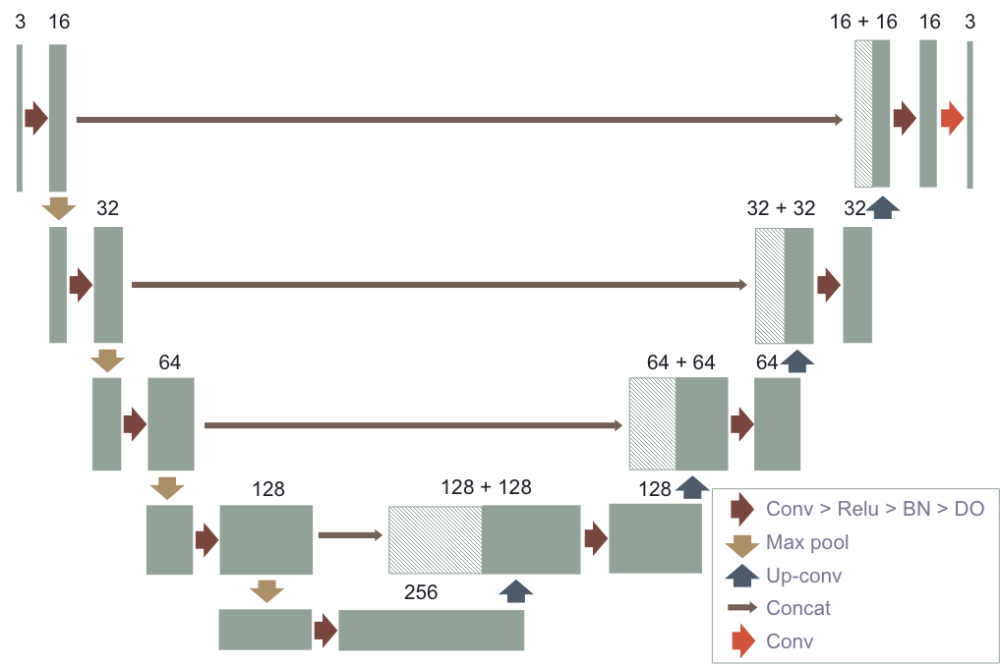
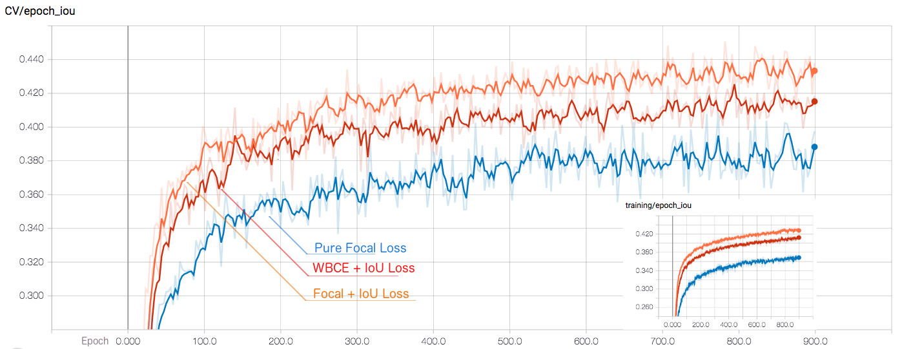
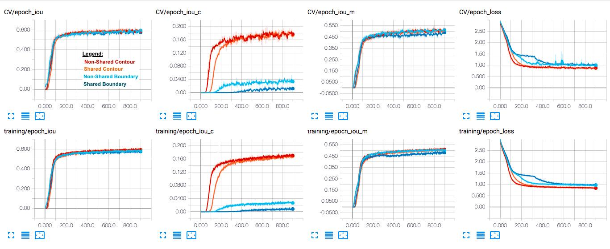
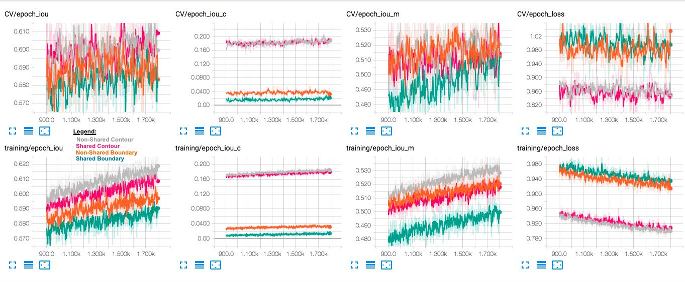
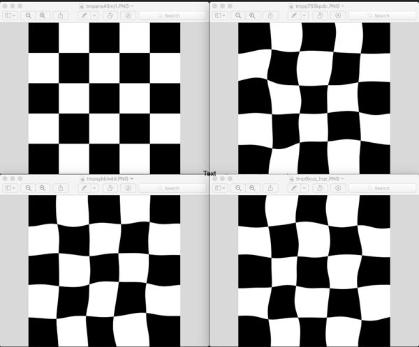
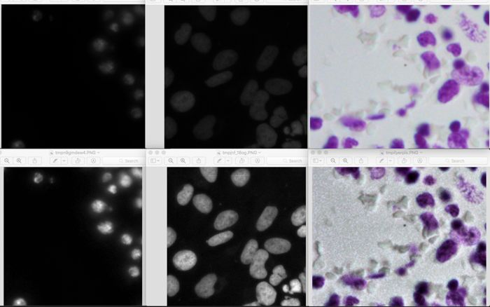

# Description

Kaggle 2018 Data Science Bowl: find the nuclei in divergent images to advance medical discovery

## Development Plan:

* Platform and framework
  - [x] PyTorch
  - [x] macOS
  - [x] Ubuntu
* Explore model architecture
  - [x] UNet
    - [x] Contour Aware model (2 tasks)
    - [x] Contour Aware Marker model (3 tasks)
    - [ ] Boundaries detection for adjacent nuclei only?
  - [x] DCAN (switch to multitask UNet judged bt experimental results)
    - [x] Training efficiency for contour detection
  - [ ] Mask RCNN
  - [ ] Mixed-Scale Dense CNN
  - [x] Dilated Convolution
  - [x] Dropout
  - [x] Batch normalization
  - Transfer learning
    + [x] Vgg (16)
    + [x] ResNet (34, 101)
    + [x] DenseNet (121, 201)
  - [x] Score function
  - Cost functions
    + [x] binary cross entropy
    + [x] pixel wise IoU, regardless of instances
    + [x] loss weight per distance of instances's boundary
    + [x] Focal loss (attention on imbalance loss)
    + [ ] Distance transform based weight map
    + [ ] Shape aware weight map
* Hyper-parameter tunning
  - [x] Learning rate
  - [x] Input size (Tried 384x384, postponed due to slow training pace)
  - [x] Confidence level threshold
  - [x] Evaluate performance of mean and std of channels
* Data augmentation
  - [x] Random crop
  - [x] Random horizontal and vertical flip
  - [x] Random aspect resize
  - [x] Random color adjustment
  - [x] Random color invert
  - [x] Random elastic distortion
  - [x] Contrast limited adaptive histogram equalization
  - [x] Random rotate
  - [x] Random noise (additive gaussian and multiplied speckle)
  - [x] Random channel shuffle and color space transform
* Dataset
  - [x] Support multiple whitelist filters to select data type
  - [x] Support manually oversample in advance mode
  - [x] Auto-balance data distribution weight via oversampling
* Pre-process
  - [x] Input normalization
  - [x] Binarize label
  - [x] Cross-validation split
  - [x] Verify training data whether png masks aligned with cvs mask.
  - [x] Blacklist mechanism to filter noisy label(s)
  - [x] Annotate edge as soft label, hint model less aggressive on nuclei edge
  - [x] Whitelist configure option of sub-category(s) for training / validation
  - Prediction datafeed (aka. arbitrary size of image prediction)
    + [x] Resize and regrowth
    + [x] Origin image size with border padding (black/white constant color)
    + [x] Origin image size with border padding (replicate border color)
    + [ ] Tile-based with overlap
  - [ ] Convert input data to CIELAB color space instead of RGB
  - [ ] Use [color map algorithm](https://stackoverflow.com/questions/42863543/applying-the-4-color-theorem-to-list-of-neighbor-polygons-stocked-in-a-graph-arr) to generate ground truth of limited label (4-), in order to prevent cross-talking
* Post-process
  - Watershed segmentation group
    + [x] Marker by statistics of local clustering peak
    + [x] Marker by contour-based from model prediction
    + [x] Marker by marker-based from model prediction
  - Random walker segmentation group
    + [ ] Marker by statistics of local clustering peak
    + [x] Marker by contour-based from model prediction
    + [x] Marker by marker-based from model prediction
  - Ensemble
    + [x] Average probability of pixel wise output of multiple models (or checkpoints)
  - [ ] Fill hole inside each segment group
* Computation performance
  - [x] CPU
  - [x] GPU
  - [x] Multiple subprocess workers (IPC)
  - [x] Cache images
  - [ ] Redundant extra contour loop in dataset / preprocess (~ 50% time cost)
  - [ ] Parallel CPU/GPU pipeline, queue or double buffer
* Statistics and error analysis
  - [x] Mini-batch time cost (IO and compute)
  - [x] Mini-batch loss
  - [x] Mini-batch IOU
  - [x] Visualize prediction result
  - [x] Visualize log summary in TensorBoard
  - [x] Running length output
  - [x] Graph visualization
  - [x] Enhance preduction color map to distinguish color of different nucleis
  - [x] Visualize overlapping of original and prediction nucleis
  - [x] Statistics of per channel data distribution, particular toward alpha
  - [x] Auto save weight of best checkpoint, IoU of train and CV, besides period save.


## Setup development environment

* Install Python 3.6 (conda recommanded)
* Install [PyTorch](http://pytorch.org/)
    ```
    $ conda install pytorch torchvision cuda91 -c pytorch
    ```

* Install dependency python packages
    ```
    $ conda install --file requirements.txt
    ```

## Prepare data

Just pick one option to prepare dataset

#### Option A: Use original DSB2018 dataset only

* [Download](https://www.kaggle.com/c/data-science-bowl-2018) and uncompress to `data` folder as below structure,
    ```
    .
    ├── README.md
    └── data
        ├── test
        │   ├── 0114f484a16c152baa2d82fdd43740880a762c93f436c8988ac461c5c9dbe7d5
        │   └── ...
        └── train
            ├── 00071198d059ba7f5914a526d124d28e6d010c92466da21d4a04cd5413362552
            └── ...
    ```

#### Option B: Use external dataset, no filter

* [Download](https://www.kaggle.com/c/data-science-bowl-2018) stage 1 test set and uncompress to `data/test` folder
* [Download](https://drive.google.com/open?id=1UJPwOFLaCS59Al_aYAGtmW5QOH9baLdv) and uncompress to `data/train` folder

#### Option C: Use external dataset, apply white-filter

* At first, follow same procedure as option B
* Download this [Google sheet](https://drive.google.com/open?id=1XEPBBQVuSZmjVXaHRAGRagxO5ewLNelZgg4VF6NqOEE) as CSV (File > Download as > Common-separated values), placed at `data/dataset.csv`
* Configure whitelist filter in `dataset` session of ` config.ini ` (detail refer `config_default.ini`)
    ```
    [train]
    ; enable auto-balance class weight via oversampling
    balance_group = True
    ;
    [dataset]
    ; white-list in dataset.csv, uncomment to enable filter
    csv_file = data/dataset.csv
    source = Kaggle, TCGA
    ```

#### Option D: Manually manage dataset and create fixed CV folder [Advance mode]

* [Download](https://www.kaggle.com/c/data-science-bowl-2018) stage 1 test set and uncompress to `data/test` folder
* Put any training dataset in arbitrary folder, say ` data/stage1_train `
* Run `split.py` to hardlink files into `train` and `valid` folders automatically. (*no extra disk space used*)
    ```
    $ python split.py data/stage1_train
    ```

* Resulting data folder as below, it's safe to delete `train` and `valid`, no impact to original files
    ```
    .
    ├── README.md
    └── data
        ├── test
        │   ├── 0114f484a16c152baa2d82fdd43740880a762c93f436c8988ac461c5c9dbe7d5
        │   └── ...
        ├── train
        │   ├── cc88627344305b9a9b07f8bd042cb074c7a834c13de67ff4b24914ac68f07f6e <────┐
        │   └── ...                                                                   │
        ├── valid                                                                     │
        │   ├── a3a5af03673844b690a48e13ae6594a934552825bd1c43e085d5f88f2856c75d <─┐  │
        │   └── ...                                                                │  │ hardlink
        └── stage1_train                                                           │  │
            ├── a3a5af03673844b690a48e13ae6594a934552825bd1c43e085d5f88f2856c75d ──┘  │
            ├── cc88627344305b9a9b07f8bd042cb074c7a834c13de67ff4b24914ac68f07f6e ─────┘
            └── ...
    ```

### Option E: Manually crop dataset [Advance mode]

* V4 dataset
    - Download [V2](https://drive.google.com/open?id=1UyIxGrVzzo7IUXRJnDRpqT3C_rXOe1s1) and uncompress to `data` folder
    - Download [TCGA no overlap](https://drive.google.com/open?id=1YB_jnDfLpZhnIj0b3wRLiiDrCtb9zNxo) and uncompress to `data` folder
    - Split TCGA to proper scale and prefered data distribution
    ```
    $ cd data
    $ python3 ../crop.py external_TCGA_train --step 200 --width 256
    $ mv external_TCGA_train_split/* source/
    ```

* V6 dataset
    - Git clone [lopuhin Github](https://github.com/lopuhin/kaggle-dsbowl-2018-dataset-fixes) and move `stage1_train` in `data` folder
    - Download [TCGA no overlap](https://drive.google.com/open?id=1YB_jnDfLpZhnIj0b3wRLiiDrCtb9zNxo) and uncompress to `data` folder
    - Split TCGA to proper scale and prefered data distribution
    ```
    $ cd data
    $ python3 ../crop.py external_TCGA_train --step 200 --width 256
    $ mv external_TCGA_train_split/* source/
    ```

* V9 dataset, or just download [here](https://drive.google.com/uc?export=download&id=1KS1E_8U019kA3XSmcFcKJjq3L9A_No0x)
    - Git clone [lopuhin Github](https://github.com/lopuhin/kaggle-dsbowl-2018-dataset-fixes) and move `stage1_train` in `data` folder
    - Download [TCGA no overlap](https://drive.google.com/open?id=1JnYY4og2DdTqcLsUd1F-pTiWYyQSUYES) and uncompress to `data` folder
    - Download [Celltracking](https://drive.google.com/open?id=1hNem6Ob4ZWybHM01_4vy5xBJ6fQ27e9I) and uncompress to `data` folder. Also remove redundant and almost the same images.
    - Download [v9 CSV]() to `data` folder
    - Split proper scale and prefered data distribution
        ```
        $ python3 crop.py data/stage1_train  --step 200 --width 256 --csv data/v9.csv
        $ python3 crop.py data/external_TCGA_train_wo_overlap --step 200 --width 256 --csv data/v9.csv
        $ python3 crop.py data/celltracking2kaggle --step 500 --width 512 --csv data/v9.csv
        $ mkdir data/train
        $ mv data/stage1_train_crop/* data/train
        $ mv data/external_TCGA_train_wo_overlap_crop/* data/train
        $ mv data/celltracking2kaggle_crop/* data/train
        ```
    - Further manually add synthesized internal data to `data/train` folder
        - Collect some prediction errors and synthesize data to relearn them.

## Hyper-parameter tunning

* Create or modify ` config.ini ` file to overwrite preferences in config_default.ini
    ```
    [param]
    weight_map = True
    model = caunet

    [contour]
    detect = True

    [valid]
    pred_orig_size = True

    [dataset]
    ; ratio of cross-valid
    cv_ratio = 0.1
    ```

## Command line usage

* Train model
    ```
    $ python3 train.py
        usage: train.py [-h] [--resume] [--no-resume] [--epoch EPOCH] [--lr LEARN_RATE]

        Grand new training ...
        Training started...
        // [epoch #][step #] CPU second (io second)     Avg.  batch  (epoch)    Avg. batch (epoch)
        Epoch: [1][0/67]    Time: 0.928 (io: 0.374)	    Loss: 0.6101 (0.6101)   IoU: 0.000 (0.000)
        Epoch: [1][10/67]   Time: 0.140 (io: 0.051)	    Loss: 0.4851 (0.5816)   IoU: 0.000 (0.000)
        ...
        Epoch: [10][60/67]  Time: 0.039 (io: 0.002)	    Loss: 0.1767 (0.1219)   IoU: 0.265 (0.296)
        Training finished...
        ...

    // automatically save checkpoint every 10 epochs
    $ ls checkpoint
        current.json   ckpt-10.pkl
    ```

* Evaluate on test dataset, will show side-by-side images on screen. Specify ` --save ` to save as files
    ```
    $ python3 valid.py
    ```

* Evaluate on cross-validation dataset with ground truth, will show side-by-side images & IoU on screen.
    ```
    $ python3 valid.py --dataset valid
    ```

* Ensemble models, say ` checkpoint/2100.pkl ` and ` checkpoint/best.pkl `
    ```
    $ python3 valid.py checkpoint/2100.pkl checkpoint/best.pkl
    ```

* Generate running length encoding of test dataset
    ```
    $ python3 valid.py --csv
    ```

## Jupyter Notebook running inside Docker container

* ssh to docker host, say ` myhost `
* Launch notebook container, expose port ` 8888 `
    ```
    $ cd ~/Code/DSB2018
    $ docker run --runtime=nvidia -it --rm --shm-size 8G -v $PWD:/mnt -w /mnt -p 8888:8888 rainbean/tensor
        ...
        Copy/paste this URL into your browser when you connect for the first time,
        to login with a token:
            http://localhost:8888/?token=8dae8f258f5c127feff1b9b6735a7cd651c6ce6f1246263d
    ```

* Open browser to url, remember to change hostname from ` localhost ` to real hostname/ip ` myhost `
* Create new notebook tab (New > Python3)
* Train model
    ```Jupyter Notebook
    In [1]: %run train.py --epoch 10

    Loading checkpoint './checkpoint/ckpt-350.pkl'
    Training started...
    Epoch: [350][59/270]	Time: 0.206 (io: 0.085)		Loss: 0.5290 (0.5996)	IoU(Semantic): 0.344 (0.263)
    ```

* Evaluate side-by-side prediction in notebook cell
    ```Jupyter Notebook
    In [2]: %matplotlib inline
    In [3]: %run valid.py
    ```

* Generate csv result
    ```Jupyter Notebook
    In [4]: %run valid.py --csv
    ```

## Model Architecture

### Model Graph

* CamUnet

    

### Model Footprint

| Model   | Pre-train   | # param | GPU memory |
| ------- | ----------- | ------- | ---------- |
| UNet    | -           | 1.94 M  | 5.5 GB     |
| Unet    | VGG16       | 9.43 M  | 7.5 GB (*) |
| Unet    | ResNet18    | 3.11 M  | 2.8 GB     |
| Unet    | ResNet34    | 3.11 M  | 3.0 GB     |
| Unet    | ResNet101   | 4.84 M  | 6.1 GB     |
| Unet    | DenseNet121 | 3.74 M  | 5.7 GB     |
| Unet    | DenseNet201 | 9.85 M  | 7.8 GB     |
| CaUnet  | -           | 2.70 M  |            |
| CamUnet | -           | 3.47 M  | 7.0 GB     |
| CamUnet | ResNet34    | 9.34 M  |            |
| SamUnet | ResNet34    | 3.11 M  |            |

(*) out-of-memory on single GPU, reduce mini-batch size to 10 samples, otherwise 20 samples
(**) measure PyTorch v0.3, v0.4 might reduce usage of memory

### Learning curve

* Comparison of cost functions

    

* Comparison of composition of convolutional blocks

    The topic of building block of composition of conv. blocks is highly discussed in technical forums and papers. Though it seems not a problem of one-size-fit-all. So here is performance comparison of various popular combinations, the result showed that CAB, `conv -> activation -> batch normal` take lead in benched model ` CAUnet `, in speed and accuracy.

    

* Shared decoder vs. Non-shared decoder &  Contour vs. Adjacent_Boundary


    The Encoder part is naturally shared by multi-heads (e.g. semantic, contour, and marker), how about Decoder part? It looks like non-shared decoder part performs better. As for detecting contour or just detecting adjacent boundary, the '<b>Instance IoU</b>' metric shows that ONLY detecting adjacent boundary outperforms detecting contour, albeit the indiviual IoU of that specific head will be much lower. You get to keep faith and patient during training phase (lesson learned!)

    

    

    |   Decoder  | Border Type       | Instance mean IoU |        Dataset         | Epoch |
    |     -      |       -           |         -         |          -             |   -   |
    | Shared     |   Contour         |        0.4453     |  Kaggle stage 1 test   |  900  |
    | Non-Shared |   Contour         |        0.4501     |  Kaggle stage 1 test   |  900  |
    | Shared     | Adjacent Boundary |        0.4292     |  Kaggle stage 1 test   |  900  |
    | Non-Shared | Adjacent Boundary |        0.4635     |  Kaggle stage 1 test   |  900  |
    | Shared     |   Contour         |        0.4507     |  Kaggle stage 1 test   | 1800  |
    | Non-Shared |   Contour         |        0.4648     |  Kaggle stage 1 test   | 1800  |
    | Shared     | Adjacent Boundary |        0.4524     |  Kaggle stage 1 test   | 1800  |
    | Non-Shared | Adjacent Boundary |        0.4807     |  Kaggle stage 1 test   | 1800  |

    - Note: all models were trained with Kaggle stage 1 training dataset only, 10% CV, 1e-4 learning rate. Post-processed with random_walker, probability thresholds (0.3, 0.3, 0.3) for 3-heads.

* Pre-trained model as UNet encoder

    Use uncropped kaggle fixed dataset, 200 epoch to evaluate effectiveness of transfer learning. Resnet_34 performed well in early time/step, power of deeper network not obvious in limited data. Vgg suffered on high comuptation and low throughput.

    

### Intermediate Model Checkpoints

* Stage 1 final submission, [here](https://drive.google.com/open?id=1QpTjcSOH3MbnFDZZPj5MGKpFCi9zBjmD)


## Benchmark

| LB | DB | Model | Cost Fn. | Epoch | Marker | SA | TP | Learn Rate | CV | Width | PO | Crop | Flip | Invert | Jitter | Distortion | Clahe | Edge Soft Label |
| ----- | ---- | -------- | ---------- | ---- | - | -- | -- | ----------- | --- | --- | - | - | - | - | - | - | - | - |
| 0.334 | Orig | UNet     | BCE        | 600  |   |    | .5 | 1e-4 > 3e-5 | 10% | 256 |   | V | V |   | V |   |   |   |
| 0.344 | Orig | UNet     | IOU+BCE    | 600  |   |    | .5 | 1e-4 > 3e-5 | 10% | 256 |   | V | V |   | V | V |   |   |
| (TBA) | Orig | UNet     | IOU+BCE    | 600  |   |    | .5 | 1e-4 > 3e-5 |  0% | 256 |   | V | V |   | V | V |   |   |
| 0.326 | v2   | UNet     | IOU+BCE    | 600  |   |    | .5 | 1e-4 > 3e-5 |  0% | 256 |   |   |   |   |   |   |   |   |
| 0.348 | v2   | UNet     | IOU+BCE    | 300  |   |    | .5 | 1e-4        | 10% | 256 |   | V | V |   | V | V |   |   |
| 0.361 | v2   | UNet     | IOU+BCE    | 600  |   |    | .5 | 1e-4 > 3e-5 |  0% | 256 |   | V | V |   | V | V |   |   |
| 0.355 | v2   | UNet     | IOU+BCE    | 600  |   |    | .5 | 1e-4 > 3e-5 |  0% | 256 |   | V | V |   | V | V | V |   |
| 0.350 | v2   | UNet     | IOU+BCE    | 1200 |   |    | .5 | 1e-4 > 3e-6 |  0% | 512 |   | V | V |   | V | V |   |   |
| 0.353 | v2   | UNet     | IOU+BCE    | 600  |   |    | .5 | 1e-4 > 3e-5 |  0% | 256 |   | V | V |   | V | V |   | V |
| 0.413 | v2   | UNet     | IOU+BCE    | 600  | P | WS | .5 | 1e-4 > 3e-5 |  0% | 256 |   | V | V |   | V | V |   |   |
| 0.421 | v3   | UNet     | IOU+BCE    | 400  | P | WS | .5 | 1e-4 > 3e-5 |  0% | 256 |   | V | V |   | V | V |   |   |
| 0.437 | v3   | UNet     | IOU+BCE    | 900  | P | WS | .5 | 1e-4        |  0% | 256 |   | V | V |   | V | V |   |   |
| 0.447 | v4   | CAUNet   | IOU+BCE    | 1800 | C | WS | .5 | 1e-4        |  0% | 256 |   | V | V |   | V | V |   |   |
| 0.460 | v4   | CAUNet   | IOU+WBCE   | 900  | C | WS | .5 | 1e-4        |  0% | 256 |   | V | V |   | V | V |   |   |
| 0.465 | v4   | CAUNet   | IOU+WBCE   | 1800 | C | WS | .5 | 1e-4        |  0% | 256 |   | V | V |   | V | V |   |   |
| 0.459 | v5   | CAUNet   | IOU+WBCE   | 1200 | C | WS | .5 | 1e-4        |  0% | 256 |   | V | V |   | V | V |   |   |
| 0.369 | v5   | CAUNet   | IOU+WBCE   | 1200 | C | WS | .8 | 1e-4        |  0% | 256 |   | V | V |   | V | V |   |   |
| 0.477 | v5   | CAUNet   | IOU+WBCE   | 1200 | C | WS | .3 | 1e-4        |  0% | 256 |   | V | V |   | V | V |   |   |
| 0.464 | v6   | CAUNet   | IOU+WBCE   | 1800 | C | WS | .5 | 1e-4        |  0% | 256 |   | V | V |   | V | V |   |   |
| 0.476 | v6   | CAUNet   | IOU+WBCE   | 1800 | C | WS | .3 | 1e-4        |  0% | 256 |   | V | V |   | V | V |   |   |
| 0.457 | v6   | CAUNet   | IOU+WBCE   | 1800 | C | WS | .2 | 1e-4        |  0% | 256 |   | V | V |   | V | V |   |   |
| 0.473 | v6   | CAUNet   | IOU+WBCE   | 1800 | C | WS | .35| 1e-4        |  0% | 256 |   | V | V |   | V | V |   |   |
| 0.467 | v6   | CAUNet   | IOU+WBCE   | 1800 | C | WS | .3 | 1e-4        |  0% | 256 | V | V | V |   | V | V |   |   |
| 0.465 | v6   | CAUNet   | IOU+WBCE   | 5000 | C | WS | .5 | 1e-4        |  0% | 256 |   | V | V |   | V | V |   |   |
| 0.480 | v6   | CAUNet   | IOU+WBCE   | 5000 | C | WS | .3 | 1e-4        |  0% | 256 |   | V | V |   | V | V |   |   |
| 0.461 | v6   | CAUNet   | IOU+WBCE   | 5000 | C | WS | .3 | 1e-4        |  0% | 256 | V | V | V |   | V | V |   |   |
| 0.458 | v6   | CAUNet   | IOU+WBCE   | 5000 | C | WS | .5 | 1e-4        |  0% | 256 | V | V | V |   | V | V |   |   |
| 0.435 | Orig | CAUNet   | IOU+WBCE   | 1800 | C | WS | .5 | 1e-4        |  0% | 256 |   | V | V |   | V | V |   |   |
| 0.472 | v4   | CAUNet   | IOU+WBCE   | 1800 | C | RW | .5 | 1e-4        |  0% | 256 |   | V | V |   | V | V |   |   |
| 0.490 | v6   | CAUNet   | IOU+WBCE   | 5000 | C | RW | .3 | 1e-4        |  0% | 256 |   | V | V |   | V | V |   |   |
| 0.469 | v6   | CAUNet   | IOU+WBCE   | 5000 | C | RW | .3 | 1e-4        |  0% | 256 | V | V | V |   | V | V |   |   |
| 0.467 | v6   | CAUNet   | IOU+Focal  | 1800 | C | WS | .3 | 1e-4        |  0% | 256 |   | V | V |   | V | V |   |   |
| 0.462 | v6   | CAUNet   | IOU+Focal  | 1800 | C | WS | .3 | 1e-4        |  0% | 256 | V | V | V |   | V | V |   |   |
| 0.472 | v6   | CAUNet   | IOU+Focal  | 1800 | C | RW | .3 | 1e-4        |  0% | 256 |   | V | V |   | V | V |   |   |
| 0.484 | v6   | CAMUNet  | IOU+Focal  | 2100 | C | RW | .5 | 1e-4        |  0% | 256 |   | V | V |   | V | V |   |   |
| 0.486 | v6   | CAMUNet  | IOU+Focal  | 2100 | C | RW | .5 | 1e-4        |  0% | 256 | V | V | V |   | V | V |   |   |
| 0.498 | v6   | CAMUNet  | IOU+F+WBCE | 2100 | C | RW | .3 | 1e-4        |  0% | 256 | V | V | V |   | V | V |   |   |
| 0.488 | v6   | CAMUNet  | IOU+F+WBCE | 3760 | C | RW | .3 | 1e-4        |  0% | 256 | V | V | V |   | V | V |   |   |
| 0.479 | v6   | CAUNet   | IoU+F+WBCE | 1800 | C | RW | .3 | 1e-4        |  0% | 256 |   | V | V |   | V | V |   |   |
| 0.479 | v6   | CAUNet   | IoU+F+WBCE | 1800 | C | RW | .3 | 1e-4        |  0% | 256 | V | V | V |   | V | V |   |   |
| 0.441 | v7   | CAUNet   | IoU+F+WBCE | 1800 | C | RW | .3 | 1e-4        |  0% | 256 | V | V | V |   | V | V |   |   |
| 0.498 | v6   | CAMUNet  | IoU+Focal2 | 4500 | C | RW | .3 | 1e-4        |  0% | 256 | V | V | V |   | V | V |   |   |
| 0.509 | v6+A1| CAMUNet  | IoU+Focal2 | 4800 | C | RW | .3 | 1e-4        |  0% | 256 | V | V | V |   | V | V |   |   |
| 0.527 | v6+A2| CAMUNet  | IoU+Focal2 | 5300 | C | RW | .3 | 1e-4        |  0% | 256 | V | V | V |   | V | V |   |   |
| 0.534 | v9   | Ensemble | IoU+Focal2 | 5300 | C | RW | .3 | 1e-4        |  0% | 256 | V | V | V |   | V | V |   |   |

Note:
- Dataset (training):
    * V1: original kaggle
    * V2: Feb 06, modified by Jimmy and Ryk
    * V3: V2 + [TCGA](https://nucleisegmentationbenchmark.weebly.com/dataset.html) 256
    * V4: V2 + TCGA 256 (Non overlapped)
    * V5: V2 + TCGA 256 (Non overlapped) + Feb. labeled test set
    * V6: [lopuhin Github](https://github.com/lopuhin/kaggle-dsbowl-2018-dataset-fixes) + TCGA 256 (Non overlapped)
    * V7: V6 + [cell tracking](http://www.celltrackingchallenge.net/datasets.html)
    * A1: 5x2 Jupiter examples
    * A2: A1 + 24 Overlapping/Touching stitching examples
    * V8: Kaggle + TCGA + Cell tracking, without manually cropping
    * V9: Kaggle + TCGA + Cell tracking + Sticking(A1+A2), with manually selection and cropping
- Score is public score on kaggle site
- Zero CV rate means all data were used for training, none reserved
- Adjust learning rate per 300 epoch
- Cost Function:
    * BCE: pixel wise binary cross entropy
    * WBCE: pixel wise binary cross entropy with weight
    * IOU: pixel wise IoU, regardless of instance
    * Focal: Focal loss with pixel wise wise binary cross entropy, weighted by contour
    * Focal2: Focal loss with pixel wise wise binary cross entropy, weighted by contour and centroid
- TP: threshold of prediction probability
- PO (predict origin size): true to keep original test image in prediction phase, otherwise resize as training width
- SA (segmentation algorithm): WS (Watershed), RW (RandomWalker)
- Marker (marker for segmentation):
    * P: local peak max of clustering
    * C: predicted contour of model output
- Ensemble: CamUNet + CamDUNet


## Known Issues

* Error: multiprocessing.managers.RemoteError: AttributeError: Can't get attribute 'PngImageFile'
    ```
    Reproduce rate:
        1/10
    Root cause:
        PyTorch subprocess workers failed to communicate shared memory.
    Workaround:
        Ignore and issue command again
    ```

* Train freeze or runtime exception running in docker container
    ```
    Root cause:
        PyTorch subprocess worker require enough shared memory for IPC communication.
    Fix:
        Assign --shm-size 8G to reserve enough shared memory
    Example:
        $ docker run --runtime=nvidia -it --rm --shm-size 8G -v $PWD:/mnt -w /mnt rainbean/tensor python train.py
    ```

## Transform effect demo

* Random elastic distortion

    

* Random color invert

    

* Random color jitter

    

* Clahe color equalize

    

* Image border padding: constant vs replicate. Used in origin size prediction.

    

