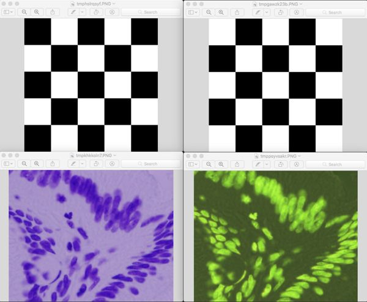
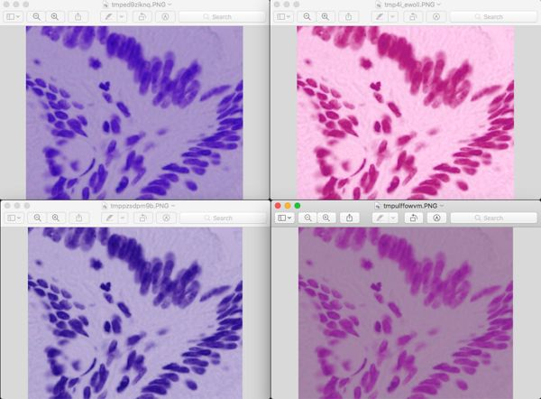

# Description

Kaggle 2018 Data Science Bowl: find the nuclei in divergent images to advance medical discovery

## Development Plan:

* Platform and framework
  - [x] PyTorch
  - [x] macOS
  - [x] Ubuntu
* Explore model architecture
  - [x] UNet
    - [x] Effectiveness for contour detection
    - [ ] Boundaries detection for adjacent nuclei only?
  - [x] DCAN (switch to multitask UNet judged bt experimental results)
    - [x] Training efficiency for contour detection
  - [ ] Mask RCNN
  - [x] Dropout
  - [x] Batch normalization
  - [x] Transfer learning
  - [x] Cost function
  - [x] Score function
* Hyper-parameter tunning
  - [ ] Learning rate
  - [ ] Input size
  - [ ] Confidence level threshold
  - [ ] Evaluate performance of mean and std of channels  
* Data augmentation
  - [x] Random crop
  - [x] Random horizontal and vertical flip
  - [x] Random aspect resize
  - [x] Random color adjustment
  - [x] Random color invert
  - [x] Random elastic distortion
  - [x] Contrast limited adaptive histogram equalization
  - [ ] Random rotate
* Public dataset extension
  - [ ] ... 
* Pre-process 
  - [x] Input normalization
  - [x] Binarize label
  - [x] Cross-validation split
  - [x] Verify training data whether png masks aligned with cvs mask. 
  - [x] Blacklist mechanism to filter noisy label(s)
  - [x] Annotate edge as soft label, hint model less aggressive on nuclei edge
  - [ ] Convert input data to CIELAB color space instead of RGB
  - [ ] Arbitrary image size handling, eg. brige & up-sample size alignment
  - [ ] Use [color map algorithm](https://stackoverflow.com/questions/42863543/applying-the-4-color-theorem-to-list-of-neighbor-polygons-stocked-in-a-graph-arr) to generate ground truth of limited label (4-), in order to prevent cross-talking 
* Post-process
  - [x] Segmentation group by scipy watershed algorithm
  - [x] Segmentation group by scipy watershed algorithm with contour-based markers
  - [ ] Fill hole inside each segment group
  - [ ] ...
* Computation performance
  - [x] CPU
  - [x] GPU 
  - [x] Multiple subprocess workers (IPC) 
  - [x] Pretech / cache images
* Statistics and error analysis
  - [x] Mini-batch time cost (IO and compute)
  - [x] Mini-batch loss
  - [x] Mini-batch IOU
  - [x] Visualize prediction result
  - [x] Visualize log summary in TensorBoard
  - [x] Running length output
  - [x] Graph visualization
  - [x] Enhance preduction color map to distinguish color of different nucleis
  - [x] Visualize overlapping of original and prediction nucleis
  - [x] Statistics of per channel data distribution, particular toward alpha
 

## Setup development environment

* Install Python 3.5 and pip
* Install [PyTorch](http://pytorch.org/)
    ```
    // macOS
    $ pip3 install http://download.pytorch.org/whl/torch-0.3.0.post4-cp35-cp35m-macosx_10_6_x86_64.whl 
    $ pip3 install torchvision 
    // Ubuntu
    $ pip3 install http://download.pytorch.org/whl/cu80/torch-0.3.0.post4-cp35-cp35m-linux_x86_64.whl 
    $ pip3 install torchvision
    ```

* Install dependency python packages
    ```
    $ pip3 install -r requirements.txt
    ```

## Prepare data

* [Download](https://www.kaggle.com/c/data-science-bowl-2018) and uncompress to `data` folder as below structure,

```
.
├── README.md
├── data
    ├── stage1_test
    │   ├── 0114f484a16c152baa2d82fdd43740880a762c93f436c8988ac461c5c9dbe7d5
    │   └── ...
    └── stage1_train
        ├── 00071198d059ba7f5914a526d124d28e6d010c92466da21d4a04cd5413362552
        └── ...
```

* (Optional) Experiment model per image category, eg. Histology
    - Open [Test](https://docs.google.com/spreadsheets/d/11Ykxp7uW763WXvhNoK_LvhnDV7Q6yT7Hr0f-vDAd-mo/edit?usp=drive_web&ouid=111494078798053745646) and [Train](https://docs.google.com/spreadsheets/d/1Yw-x8T4p2oChaWlLem1yyE7qN6XU3tnedj6rCCqLg4M/edit#gid=537769059) Google sheet 
    - Download CSV format (File > Download as > Common-separated values)
    - Rename and copy to `data` folder as below
        ```
        .
        ├── README.md
        ├── data
            ├── stage1_test.csv <--- rename to this
            ├── stage1_test
            │   ├── 0114f484a16c152baa2d82fdd43740880a762c93f436c8988ac461c5c9dbe7d5
            │   └── ...
            ├── stage1_train.csv <--- rename to this
            └── stage1_train
                ├── 00071198d059ba7f5914a526d124d28e6d010c92466da21d4a04cd5413362552
                └── ...
        ```

    - Uncomment below code in `train.py` and `valid.py`
        ```Python
        # train.py 
        dataset = KaggleDataset('data/stage1_train', transform=Compose(), cache=cache)
        # dataset = KaggleDataset('data/stage1_train', transform=Compose(), cache=cache, category='Histology')

        # valid.py 
        dataset = KaggleDataset('data/stage1_test', transform=compose)
        # dataset = KaggleDataset('data/stage1_test', transform=compose, category='Histology')
        ```

* (Optional) prepare V3 dataset
    - Download [V2](https://drive.google.com/open?id=1UyIxGrVzzo7IUXRJnDRpqT3C_rXOe1s1) and uncompress to `data` folder
    - Download [TCGA](https://drive.google.com/open?id=13zrouhpaM7_df-pqC6ClOoeOm8B3sBb0) and uncompress to `data` folder
    - Split TCGA to proper scale and prefered data distribution
    ```
    $ cd data
    $ python3 ../split.py external_TCGA_train --step 200 --width 256
    $ mv external_TCGA_train_split/* stage1_train/
    ```

## Change default configuration

Create a ` config.ini ` file, in which you may overwrite any setting in config_default.ini
```
; copy and modify customer setting, for example
;
[param]
model = unet_nuclei
cv_ratio = 0

[train]
n_batch = 64
```


## Command line usage

* Train model
    ```
    $ python3 train.py
        usage: train.py [-h] [--resume] [--no-resume] [--epoch EPOCH] [--lr LEARN_RATE]

        Grand new training ...
        Training started...
        // [epoch #][step #] CPU second (io second)     Avg.  batch  (epoch)    Avg. batch (epoch)
        Epoch: [1][0/67]    Time: 0.928 (io: 0.374)	    Loss: 0.6101 (0.6101)   IoU: 0.000 (0.000)	
        Epoch: [1][10/67]   Time: 0.140 (io: 0.051)	    Loss: 0.4851 (0.5816)   IoU: 0.000 (0.000)
        ...
        Epoch: [10][60/67]  Time: 0.039 (io: 0.002)	    Loss: 0.1767 (0.1219)   IoU: 0.265 (0.296)
        Training finished...
        ...
    
    // automatically save checkpoint every 10 epochs
    $ ls checkpoint
        current.json   ckpt-10.pkl
    ```

* Evaluate on test dataset, will show side-by-side images on screen. Specify ` --save ` to save as files
    ```
    $ python3 valid.py
    ```

* Evaluate on train dataset with ground truth, will show side-by-side images & IoU on screen. Specify ` --save ` to save as files
    ```
    $ python3 valid.py --dataset train
    ```

* Generate running length encoding of test dataset
    ```
    $ python3 valid.py --csv
    ```

## Jupyter Notebook running inside Docker container

* ssh to docker host, say ` myhost `
* Launch notebook container, expose port ` 8888 `
    ```
    $ cd ~/Code/DSB2018
    $ docker run --runtime=nvidia -it --rm --shm-size 8G -v $PWD:/mnt -w /mnt -p 8888:8888 rainbean/pytorch
        ...
        Copy/paste this URL into your browser when you connect for the first time,
        to login with a token:
            http://localhost:8888/?token=8dae8f258f5c127feff1b9b6735a7cd651c6ce6f1246263d
    ```

* Open browser to url, remember to change hostname from ` localhost ` to real hostname/ip ` myhost `
* Create new notebook tab (New > Python3)
* Train model
    ```Jupyter Notebook
    In [1]: %run train.py --epoch 10

    Loading checkpoint './checkpoint/ckpt-350.pkl'
    Training started...
    Epoch: [350][59/270]	Time: 0.206 (io: 0.085)		Loss: 0.5290 (0.5996)	IoU(Semantic): 0.344 (0.263)
    ```

* Evaluate side-by-side prediction in notebook cell
    ```Jupyter Notebook
    In [2]: %matplotlib inline
    In [3]: %run valid.py
    ```

* Generate csv result
    ```Jupyter Notebook
    In [4]: %run valid.py --csv
    ```

## Benchmark 

| Score | Data | Width | Model | Cost Fn. | Epoch | Learning Rate | CV  | Crop | Flip | Invert | Jitter | Distortion | Clahe | Edge Soft Label | Watershed | Fill hole | 
| ----- | ---- | ----- | ----- | -------- | ----- | ------------- | --- | - | - | - | - | - | - | - | - | - |
| 0.334 | Orig | 256   | UNet  | BCE      | 600   | 1e-4 > 3e-5   | 10% | V | V |   | V |   |   |   |   |   |
| 0.344 | Orig | 256   | UNet  | IOU+BCE  | 600   | 1e-4 > 3e-5   | 10% | V | V |   | V | V |   |   |   |   |
| (TBA) | Orig | 256   | UNet  | IOU+BCE  | 600   | 1e-4 > 3e-5   |  0% | V | V |   | V | V |   |   |   |   |
| 0.326 | v2   | 256   | UNet  | IOU+BCE  | 600   | 1e-4 > 3e-5   |  0% |   |   |   |   |   |   |   |   |   |
| 0.348 | v2   | 256   | UNet  | IOU+BCE  | 300   | 1e-4          | 10% | V | V |   | V | V |   |   |   |   |
| 0.361 | v2   | 256   | UNet  | IOU+BCE  | 600   | 1e-4 > 3e-5   |  0% | V | V |   | V | V |   |   |   |   |
| 0.355 | v2   | 256   | UNet  | IOU+BCE  | 600   | 1e-4 > 3e-5   |  0% | V | V |   | V | V | V |   |   |   |
| 0.350 | v2   | 512   | UNet  | IOU+BCE  | 1200  | 1e-4 >> 3e-6  |  0% | V | V |   | V | V |   |   |   |   |
| 0.353 | v2   | 256   | UNet  | IOU+BCE  | 600   | 1e-4 > 3e-5   |  0% | V | V |   | V | V |   | V |   |   |
| 0.413 | v2   | 256   | UNet  | IOU+BCE  | 600   | 1e-4 > 3e-5   |  0% | V | V |   | V | V |   |   | V1|   |
| 0.421 | v3   | 256   | UNet  | IOU+BCE  | 400   | 1e-4 > 3e-5   |  0% | V | V |   | V | V |   |   | V1|   |
| 0.437 | v3   | 256   | UNet  | IOU+BCE  | 900   | 1e-4          |  0% | V | V |   | V | V |   |   | V1|   |
| 0.460 | v4   | 256   | CAUNet| IOU+BCE(weight)  | 900   | 1e-4  |  0% | V | V |   | V | V |   |   | V2|   |

Note:
- Dataset (training): 
    * V1: original kaggle
    * V2: Feb 06, modified by Jimmy and Ryk
    * V3: V2 + TCGA 256
    * V4: V2 + TCGA 256 (Non overlapped)
- Score is public score on kaggle site
- Zero CV rate means all data were used for training, none reserved
- Adjust learning rate per 300 epoch

## Known Issues

* Error: multiprocessing.managers.RemoteError: AttributeError: Can't get attribute 'PngImageFile'  
    ```
    Reproduce rate: 
        1/10  
    Root cause: 
        PyTorch subprocess workers failed to communicate shared memory.  
    Workaround: 
        Ignore and issue command again
    ```

* Train freeze or runtime exception running in docker container
    ```
    Root cause: 
        PyTorch subprocess worker require enough shared memory for IPC communication.  
    Fix: 
        Assign --shm-size 8G to reserve enough shared memory
    Example: 
        $ docker run --runtime=nvidia -it --rm --shm-size 8G -v $PWD:/mnt -w /mnt rainbean/pytorch python3 train.py
    ```

## Transform effect demo

* Random elastic distortion  

     

* Random color invert  

     

* Random color jitter  

     

* Clahe color equalize

     

