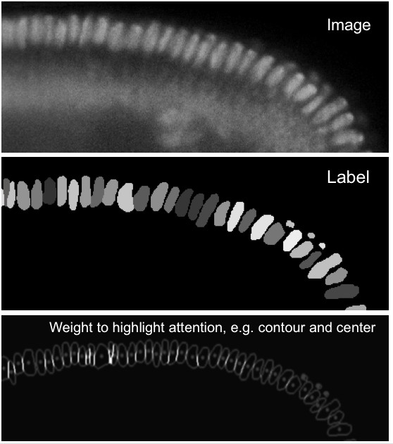
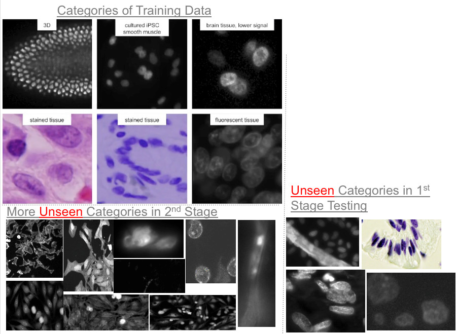
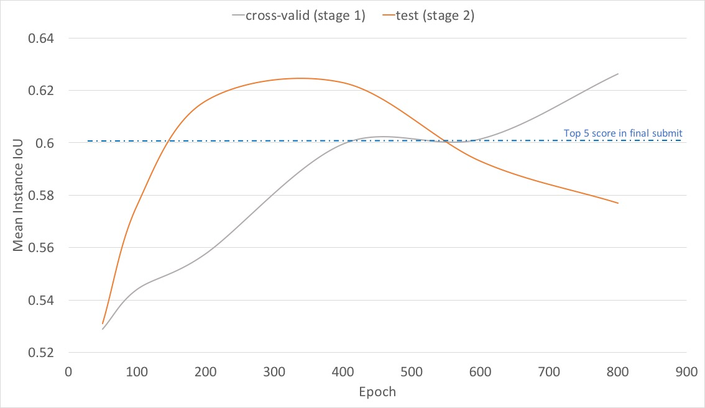

## In the begining

Even though never attend to any data science compeition or real project, I though it could be quite fresh air after worked on a website project for a while. I even thought to myself: "huh, how challenging it could be but just to tell pixel from background to foreground". Well, eventually it proved how ignorance I was...

## First thing first, skeleton and data pipeline

It's emphasized that 'generalizability' is the key goal of this [competition](https://www.kaggle.com/c/data-science-bowl-2018/). Given the small amount of training set and its diversity, we concluded that we'll need a lot of data augmentation in data pipeline. Furthermore, easy debugging and integration with existing Python modules would be also important. PyTorch sounds to us a better choice than TensorFlow for the matter.

Both [MaskRCNN](https://arxiv.org/abs/1703.06870) and [UNet](https://arxiv.org/abs/1505.04597) should be able to attack segmentation problem, and some papers claimed UNet working quite well in medical imaging. So we picked UNet and built our own codebase from scratch, also did lots of experiments with regarding to data augmentation (random crop, flip, rotate, resize, color jitter, elasitc distortion, color invert, clahe, and gaussian noise). Even though some effects did not help in experiments, say color invert, clahe, and gaussian noise.

This vanilla UNet reached LB 0.34, trained without external dataset, used Binary Cross-Entropy (BCE) loss function. Then cost function was changed to Jaccard/IoU + BCE, it helped to reach LB 0.36.

## One month model exploration after first two weeks

Reviewed output visualization of vannila UNet, single binary output obviously not good enough to attack boundary and overlapping of nuclei. thus we start to think what could be done to improve vanilla UNet model. 

First idea was transfrer learning. A well trained model should mitigate data quantity issue and provde richer low level features as first part of UNet model. We tried VGG16, but unfortunately, no improvement was seen at that time. (note: revisited transfer learning in post-competition)

In early experiment by leverage computer vision morphology algorithm, watershed with peak local max, score reached LB 0.41 and we realized in fact the competition was but a instance segmentation problem. 

We found the model performed poorly in visualized prediction of histology images, besides model improvement, external dataset also started to be used. At this moment LB was 0.44

Inspired by [DCAN](https://arxiv.org/abs/1604.02677), we revise the UNet model to be multitasked. One head is semantic prediction, another head is contour prediction. However, a naive (semantic - contour) as instance segmentation prediction is not good, so we instead used (semantic - contour) as the marker of [watershed algorithm](http://scikit-image.org/docs/dev/auto_examples/segmentation/plot_watershed.html), and it brought us to LB 0.45

Revisited UNet paper, and thought that using 'weight map' to force the network to learn the border pixels should be helpful. We then implemented a weight map, which emphasizes on borders & centeriods (especially for small cells), and it brought us to LB 0.47. 

We compared the partitioning result of watershed and [random walker](http://scikit-image.org/docs/dev/auto_examples/segmentation/plot_random_walker_segmentation.html) for touching objects, and felt the result of random walker is more natural from our perspective. After changed post-processing to random walker, it brought us to LB 0.49

Reviewed aforementioned markers (semantic - contour) visually, there are always some poor cases and it's hard to design rules for them. Therefore, we decided to let the model learn and predict the markers by itself. The third head was added to predict markers, whose ground truths are derived from shrinked cell masks. We used ('markers head' - 'contour head') as the final markers for random walker to partition the 'semantic head'. 

In order to further conquer the data imbalance issue, we implemented [Focal loss](https://arxiv.org/abs/1708.02002) in addition to aforementioned Jaccard/IoU loss function and weight map mechanism. It brought us to LB 0.50.

By adding synthesized images of touching/overlapping cells to training set, it could reach LB 0.52, ranked #22 at that moment. 

## Struggled in last month

We analyzed error cases of competition stage 1 test data, one of major issues was large cells (scaling), another was lack of similiar data in training set. 

To address scaling issue, we tried to expand the receptive field of encoder part of UNet via dilated convolution. We found dilated and non-dilated encoder seems to be complement each other, so we ensembled these two models by averaging their pixel-wise prediction of three heads.

Back and forth, we spent lots effort in collecting and validating external dataset as training set, data manipulation brought us to LB 0.534, but it's tedious and domain knowledge intensive. 

Also Test Time Augmentation (TTA) was experimented by horizontal flip, vertical flip, horizontal and vertical flip. However, an implementation error on reflect padding & flip pipeline made us drop TTA before end of competition (note: revisited TTA in post-competition)

Surprised at the huge difference between stage1 train/test and stage 2 test dataset, we added additional BBBC018, BBBC020, and stage 1 test to further train the models. That was a mistake to put everything in training, resulting no objective local cross validataion to judge overfitting, but relied on human judgement on visualized predictions. (note: see how we react in post-competition)

We thought the longer model was trained the better score it could be based on learning curve observed in stage 1, (:facepalm: another mistaken mentioned in post-competition), yet it turned out that we chose the worse one on final submission. Our major struggle in final week was that no validataion set similar to test set (Andrew Ng had a great talk about [Nuts and Bolts of Applying Deep Learning](https://www.youtube.com/watch?v=F1ka6a13S9I) in this regard). 

## Post-Competition & Late Submissions

Read some nice writeups of top winning solutions (UNet-based), there were many technical approaches in common, and few practices we did not do well. For examples:

- Data Augmentation: channel shuffle and rgb/gray color space transformation (it didn't show improvement in our experiments)
- Implement TTA correctly, which turns out help the score a lot (0.569 -> 0.580)
- Transfer learning with deep neural network (Resnet), which speed up the training and accuracy.
- Try shared decoder and separated decoders for multitasks, and ensemble them for final prediction.

At last but not least important, we used stage 1 test as validation set (totally isolated from training set), and saw the high variance of LB private score (0.56 ~ 0.623) along the training epochs. 

The figure hints the data distribution of stage 1 test set is not similar to stage 2 test set, it's somehow like a lottory here since we can't have a reasonable local validation set for stage 2 test set (with tons of on-purposed posion images). 

Unfortunately, this is still an unanswer question to ourself.

## Reference

- [Github Code](https://github.com/samuelschen/DSB2018)
- []